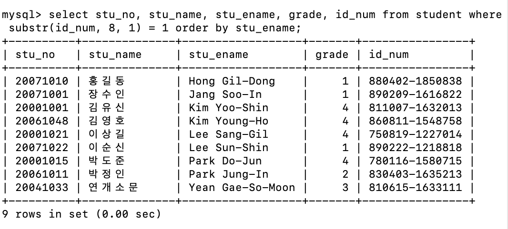
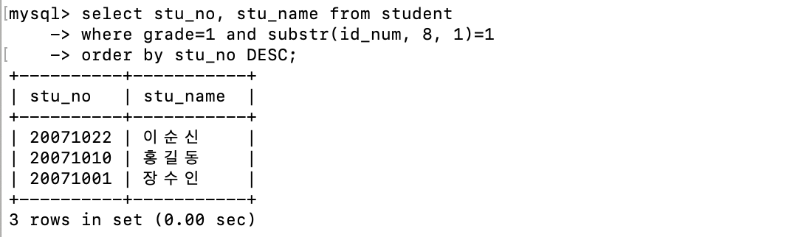
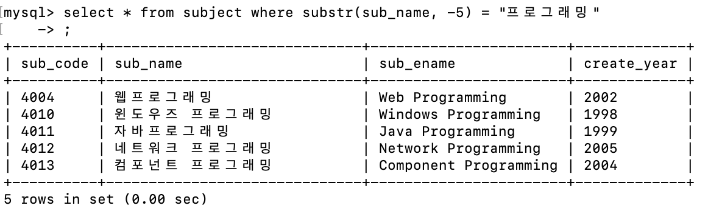
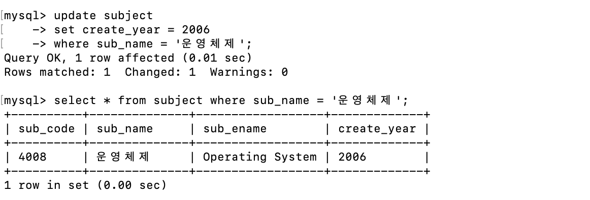
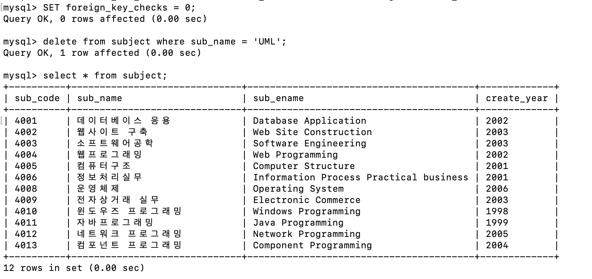
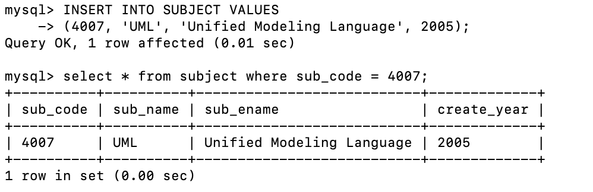
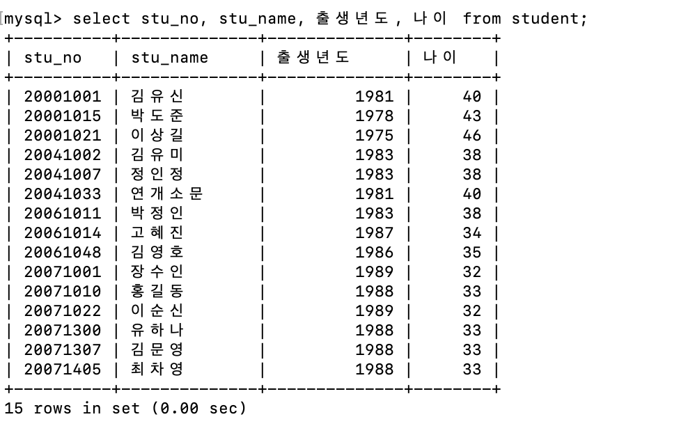

## 1주차 실습

**문제1.**  student 테이블로부터 성별이 남자인 각 학생의 학번, 이름, 영문이름, 학년, 주민등록번호를 영문이름 순서대로 출력하라.

```sql
select stu_no, stu_name, stu_ename, grade, id_num from student where substr(id_num, 8, 1) = 1 order by stu_ename;
```



**문제2.**  student 테이블로부터 학년이 1학년이고 성별이 남자인 각 학생의 학번과 이름을 출력하는데, 출력 순서는 학번을 기준으로 내림차순으로 정렬하여라.

```sql
select stu_no, stu_name from student
-> where grade=1 and substr(id_num, 8, 1)=1
-> order by stu_no DESC;
```



**문제3.**  subject 테이블로부터 과목 이름이 프로그래밍으로 끝나는 데이터를 모두 출력하라.

```sql
select * from subject where substr(sub_name, -5) = "프로그래밍";
```



**문제4**. subject 테이블로부터 운영체제 과목의 생성 년도를 2006년으로 변경하고 변경된 결과를 출력하라.

```sql
update subject
-> set create_year = 2006
-> where sub_name = '운영체제';
```



**문제5.** subject 테이블로부터 과목명(sub_name)이 UML인 과목을 삭제하고 subject 테이블을 출력하라. (에러가 발생할 경우 과목코드를 참조하는 테이블의 행을 먼저 삭제하고 진행)

```sql
SET foreign_key_checks = 0;
delete from subject where sub_name = 'UML';
select * from subject;
```



**문제6**. subject 테이블에 교과목 코드(4007), 교과목명(UML), 교과목영문이름(Unified Modeling Language), 생성년도(2005)인 새로운 행을 삽입하는 명령어를 작성하라.

```sql
INSERT INTO SUBJECT VALUES
(4007, 'UML', 'Unified Modeling Language', 2005)
```



**문제7**. student 테이블의 학번, 이름 출생년도, 나이를 출력하라

```sql
ALTER TABLE student ADD COLUMN 출생년도 INT AS (1900 + SUBSTR(id_num, 1, 2));
ALTER TABLE student ADD COLUMN 나이 INT AS (2021 - SUBSTR(출생년도, 1, 4));
select stu_no, stu_name, 출생년도, 나이 from student;
```

